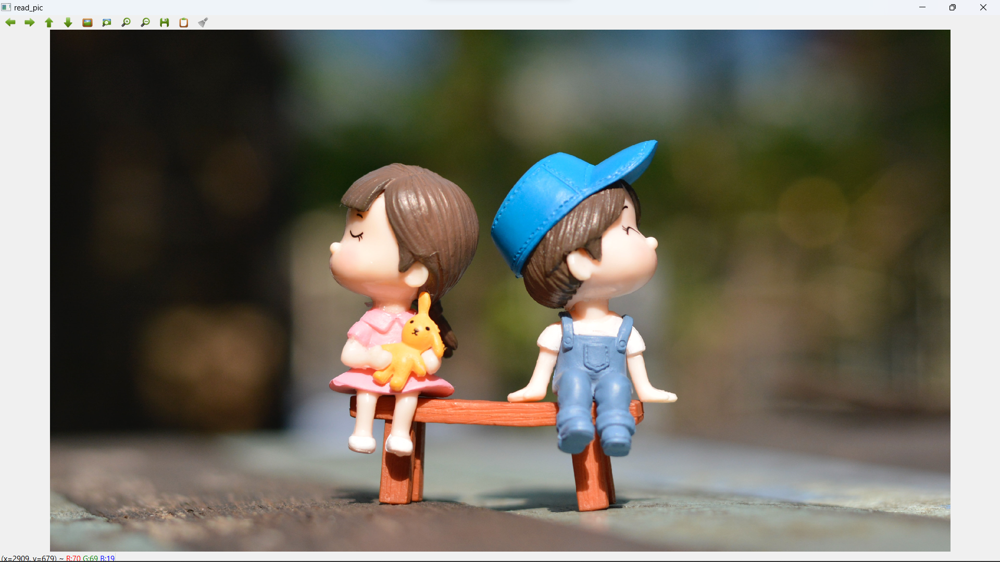
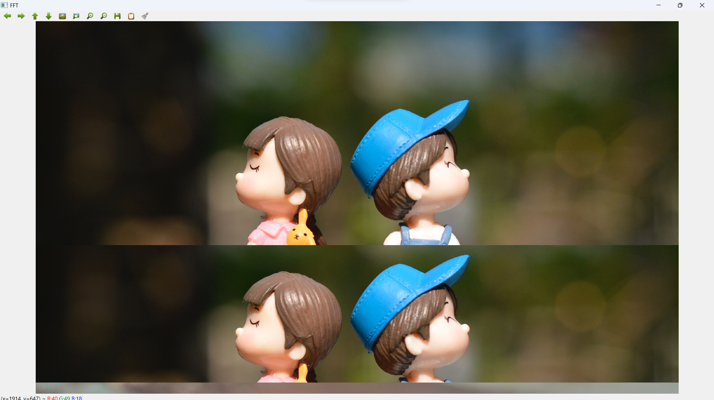

# <p align="center">READ AND WRITE AN IMAGE</p>
## AIM
To write a python program using OpenCV to do the following image manipulations.
1. Read, display, and write an image.
2. Access the rows and columns in an image.
3. Cut and paste a small portion of the image.

## Software Required:
Anaconda - Python 3.7
## Algorithm:
### Step1:
Choose an image and save it as a filename.jpg
### Step2:
Use imread(filename, flags) to read the file.
### Step3:
Use imshow(window_name, image) to display the image.
### Step4:
Use imwrite(filename, image) to write the image.
### Step5:
End the program and close the output image windows.
## Program:
Developed By: **SWATHKA G**
<br/>
Register Number: **212221230113**
<br/>
<br/>
<br/>
### i) Read and display the image
```py
import cv2

img = cv2.imread("aot.png")
cv2.imshow("read_pic",img)
cv2.waitKey(0)
cv2.destroyAllWindows()
```
### ii) To write the image
```py
cv2.imwrite("write_pic.png",img)
```
### iii) Find the shape of the Image
```py
print(img.shape)
```
### iv) To access rows and columns

```py
import random
for i in range (500,1000):
    for j in range(150,3582):
        img[i][j]=[random.randint(0,100),random.randint(0,80),random.randint(0,250)]
cv2.imshow("row_pic.png",img)
cv2.waitKey(8000)
cv2.destroyAllWindows()
```
### v) To cut and paste portion of image
```py
img[1300:2100,:] = img[400:1200,:]
cv2.imshow('cut',img)
cv2.waitKey(0)
cv2.destroyAllWindows()
```
<br/>
<br/>
<br/>
<br/>
<br/>
<br/>
<br/>
<br/>
<br/> 
<br/>

## Output:

### i) Read and display the image


### ii) Write the image


### iii) Shape of the Image


<br/>
<br/> 


### iv) Access rows and columns


### v) Cut and paste portion of image


## Result:
Thus the images are read, displayed, and written successfully using the python program.
